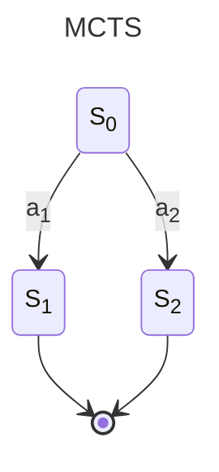

# Model

> How the model works?

$f_\theta(s) = (p,v)$

_s_ : State  
_p_ : policy  
_v_ : value  

## Monte Carlo Tree Search

|Steps|Description|
|-----|-----------|
|Selection|Walk down until leaf node|
|Expansion|Create new node|
|Simulation|Play randomly|
|Backprogation|Backpropogate to update weights|

$s_i$ : state $i$

$a_i$ : action $i$

$w_i$ : number of wins while traversing through $s_i$.

$n_i$ : number of traversal through the state $s_i$

UCB : $w_i \over n_i$ + $c  \sqrt{ln(N_i)\over n_i}$

### Process

1. Create a root node with $w_i = 0$ & $n_i = 0$.
2. Expand the root node. _Let's assume we got 2 states $s_1$ and $s_2$._
3. Play randomly till the end. If you win update $w_i := w_i + 1$. Update $n_i := n_i + 1$.
4. Update the values of _n_ & _w_ till the root node.
5. Calculate UCB.
6. Select the node with higher UCB and expand it.

Number of iteration is _hyperparameter_.

## Alpha Monte Carlo Tree Search

Updated UCB: $w_i \over n_i$ + $p_i C$ * $\sqrt{N_i} \over 1+n$

> __There is no simulation in AMCTS.__

$(p ,v) = f(S_o)$

The simulation is replaced by a policy and value which are calculated by a fucntion.

Perform $\alpha$MCTS and act based on the MCTS-distribution.(Play the move having max $\alpha$-MCTS score.)

Play till game terminates or a draw occurs.

### Training

> Add $(state, mcts-dist, reward)$ tuple to training data.

__Reward__:
|Condition|Score|
|---------|-----|
|Win      |1    |
|Loss     |-1   |
|Draw     |0    |

1. Take sample from training data.  
         $s, \pi , z$ = Sample 
2. Get output from the model.  
        $f_\theta (s)$ = $(p,v)$
3. Minimize loss through backpropogation.  
        $l = (z - v)^2 - \pi ^ T log(p) + c||\theta||^2$   (MSE + Multi-target cross-entropy loss)

------------------------------

