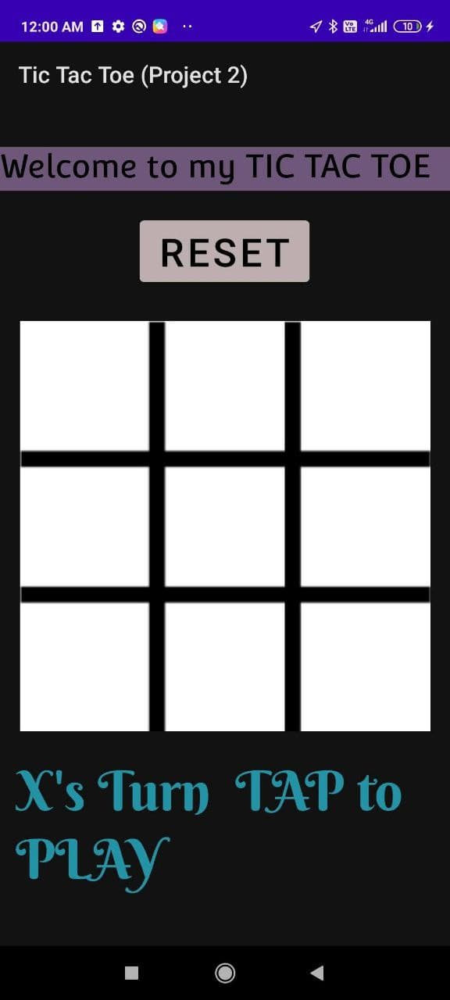
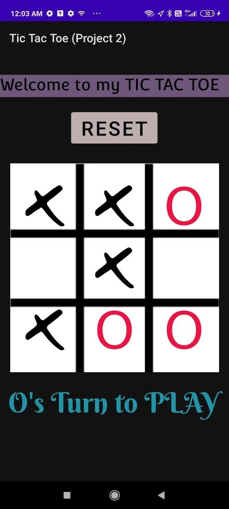

# *My Tic-Tac-Toe App*
This is a 2 player Tic Tac Toe game which also has a reset button for playing the game multiple times. 
##### You can access the apk in th main folder.

----------------------------------------------------------------------------------------------------------------------------------------------------------------------------------

# *MCTS[Monte Carlo Tree Search] for TicTacoe

Implementation of Monte-Carlo Tree search for tic-tac-toe.

[Explanation](Model.md)

### Tests
> Perform from root directory!

1. 2-player:
```bash
python -m test.play_ttt_manual
```

2. MCTS-based:
```bash
python -m test.play_ttt_mcts
```


----------------------------------------------------------------------------------------------------------------------------------------------------------------------------------
### **Screenshots** 
************
  
************



************


